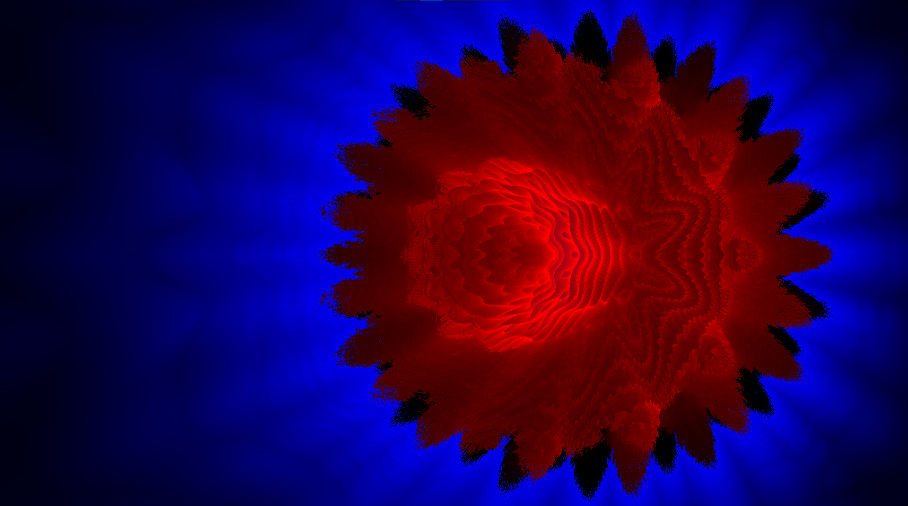

# enhanced-fractals

Small but fast fractal engine that does inverted **ambient occlusion** and adds **glow** to the background.
> I inverted the ambient occlusion to give the rendered fractal an inner glow.
